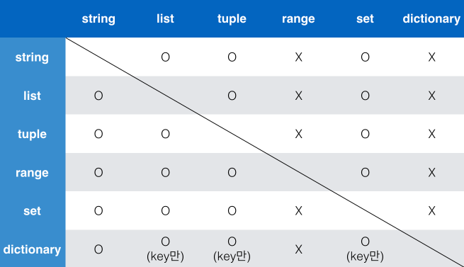
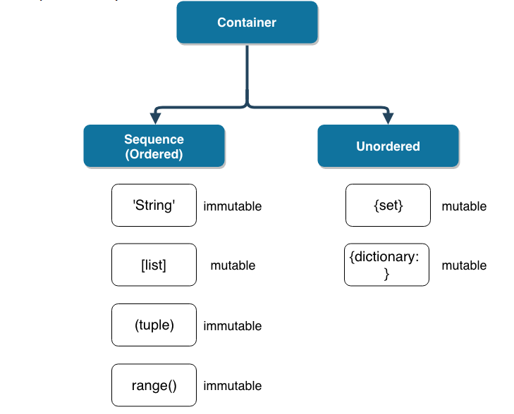

## July, 20th, 2021(Tue)

 #### 1. What did i study?

```
 - 컨테이너( 시퀀스형 컨테이너, 비 시퀀스형 컨테이너)
 - 제어문
 	º 조건문(if)
 	º 반복문 (for, while)
```


#### 2. New Knowledge(새로 알게된 사실만 기술합니다)


#### # 컨테이너

---

1. **시퀀스형 컨데이너** : 시퀀스는 데이터가 순서대로 나열된 형식을 나타낸다.**(정렬되었다는 뜻이 아님!)**
   - 종류 :  리스트, 튜플, 레인지, 문자형, 바이너리

- **튜플형**

  ```python
  (value1, value2)
  ```
  
  튜플은 리스트와 유사하지만, `()`로 묶어서 표현

  그리고 tuple은 수정 불가능(불변, immutable)하고, 읽을 수 만있다.

  직접 사용하기 보다는 파이썬 내부에서 다양한 용도로 활용되고 있습니다.(아직은 활용방법 모름)

  - 파이썬에서 사용하는 swap 형태가 내부적으로 튜플을 이용함.

  ```python
  x, y = y, x
  print(x)
  print(y)
  ```
  
  ```python
# 빈 튜플
  empty=()

  print(type(empty)) # <class 'tuple'>
  print(len(empty)) # 0
  ```
  
  - 하나의 요소(값)으로 구성된 tuple은 쉼표를 꼭 붙여줘야한다. -> a = (1,) 쉼표없으면 string형식이다.

    

- **시퀀스에서 활용할 수 있는 연산자/함수**

|    operation |          설명           |
| -----------: | :---------------------: |
|     x `in` s |    containment test     |
| x `not in` s |    containment test     |
|    s1 `+` s2 |      concatenation      |
|      s `*` n | n번만큼 반복하여 더하기 |
|       `s[i]` |        indexing         |
|     `s[i:j]` |         slicing         |
|   `s[i:j:k`] |    k간격으로 slicing    |
|       len(s) |          길이           |
|       min(s) |         최솟값          |
|       max(s) |         최댓값          |
|   s.count(x) |        x의 개수         |

​	=> 시퀀스를 알고 있는 것도 좋지만, 알고리즘 형식으로 푸는 연습을 더 하자!

​		º list slice : 구간을 나눠서 그 사이를 출력한다고 생각하자

```python
location=['서울','부산','대구','대전','광주']
location[2:3] # '대구'
  ```

---

2. **비시퀀스형  컨데이너** : set, dictionary

   - **set** 

     

     `set`은 순서가 없고 중복된 값이 없는 자료구조이다.

     - `set`은 수학에서의 집합과 동일하게 처리된다.

     - `set`은 중괄호`{}`를 통해 만들며, 순서가 없고 중복된 값이 없습니다.

     - 빈 세트를 만들려면 `set()`을 사용해야 한다. (`{}`로 사용 불가능)

     - 활용 가능한 연산자는 차집합(`-`), 합집합(`|`), 교집합(`&`)이다.

       

   - **dictionary**

     
   
     dictionary는 `key`와 `value`가 쌍으로 이뤄져있다.
     
     ```python
     {Key1:Value1, Key2:Value2, Key3:Value3, ...}
     ```
     
     - `{}`를 통해 만들며, `dict()`로 만들 수 있다.
     - `key`는 **변경 불가능(immutable)한 데이터**만 가능 (immutable : string, integer, float, boolean, tuple, range)
     - `value`는 `list`, `dictionary`를 포함한 모든 것이 가능


---

​																								**<컨테이너 형변환>**





---

3.  **데이터의 분류**

| Mutable    | Immutable |
| ---------- | --------- |
| List       | String    |
| Dictionary | Tuple     |
| Set        | Range     |

**+) 데이터의 분류와 시퀀스와 비시퀀스형 헷갈리므로 기억 꼭 하기!!**




---


#### # 제어문


1. **조건문(if)**

   - 조건문의 경우 배웠던 다른 언어들과 문법만 조금 다르므로 예시를 통해 python문법 if문을 보자.

     ```python
     num = int(input('숫자를 입력하세요 : '))
     
     if num % 2 == 0 : print('짝수입니다.')
     else : print('홀수입니다.')
     ```

     

   - 조건문의 경우 순서대로 조건식을 검증하므로, 순서에 유의해야 한다.
   
     ```python
     score = int(input('점수를 입력하세요 : '))
      
     # 올바른 형태    
     if score >= 90 : print('A')
     elif score >=80 and score < 90 : print('B')
     elif score >=70 and score < 80 : print('C')
     elif score >=60 and score < 70 : print('D')
     else : print('F')
         
     #순서를 지키지 않은 경우
     score = 80
     
     if score >= 90:
         print('A')
     elif score >= 60:
         print('D학점') # 이부분이 출력이된다.
     elif score >= 80:
         print('B')
     ```

     
   
   - 조건 표현식(python문법)
   
     
     
     - 조건 표현식은 일반적으로 조건에 따라 값을 정할 때 활용된다.
     - **삼항 연산자(Ternary Operator)**라고 부르기도 한다.
   
   ```python
   num=2
   
   result = '홀수입니다.'if num%2  else '짝수입니다.'
   print(result)
   ```

---

2. **반복문**

   

   - **while** : 잘 안쓰다 보니, 헷갈리는 경우가 있다. while은 참일 때 까지 도는 것이다.

     

     - 예시

     ```python
     while True:
         print('조건식이 참일 때까지')
         print('계속 반복합니다')
     ```

     - 한자리씩 출력하기(실습)

     ```python
     num = int(input()) # 1234
     
     while num >0 :
         rest_num = num % 10
         print(rest_num)
         num = num // 10
      
     #출력
     #4
     #3
     #2
     #1
     ```

     

   - **for (아는 부분 생략)**

     

     - **enumerate()**
     
       인덱스(index)와 값(value)을 함께 활용 가능하다.

   ​				`enumerate()`를 활용하면, 추가적인 변수를 활용할 수 있다

   ```python
   lunch = ['짜장면', '초밥', '피스타']
   
   for idx, menu in enumerate(lunch):
       print(idx, menu)
       
   # enumerate() 에 의해 반환되는 인덱스가 1로 시작하여 카운트되는 for 반복문을 작성해봅시다.
   for idx, menu in enumerate(lunch, start=1):
       print(idx, menu)
   
   ```

   

   - **반복제어(break, continue, for-else)**

     

     - `break` vs `continue`
       - break : `for` 나 `while` 문에서 빠져나간다.
       - continue :  continue 이후의 코드를 수행하지 않고 *다음 요소부터 계속(continue)하여* 반복을 수행한다.

     ```python
     # break문은 익숙하므로 continue 문의 예시를 들겠습니다.
     # 미성년자인 사람만 출력하는 프로그램
     ages = [10, 23, 8, 30, 25, 31]
     
     for age in ages :
         
         if age > 20 : 
             continue 
         print(f'{age}는 미성년자입니다.')
     ```

     

     - else : **파이썬에만 있는 문법.** for else

       끝까지 반복문을 실행한 이후에 실행됩니다.

       - 반복에서 리스트의 소진이나 (`for` 의 경우) 조건이 거짓이 돼서 (`while` 의 경우) 종료할 때 실행된다.
       - 하지만 반복문이 **`break` 문으로 종료될 때는 실행되지 않는다.** (즉, `break`를 통해 중간에 종료되지 않은 경우만 실행)

     ```python
     # 리스트에 4가 있는 경우 true 출력, 없는 겨우 False 출력
     
     numbers = [1, 3, 7, 4, 9]
     
     for num in numbers :
         if num == 4 : 
             print("True")
             break
     else : print("False")
         
     # for else 가 없는 언어에서 하는 방법
     
     flag = bool()
     
     for num in numbers :
         if num == 4 : 
             flag = True
             break
         else : flag = False    
     
     if flag : print("True")
     else : print("False")    
     
     ```

     - pass : 아무것도 하지 않는 용도. 문법적으로 문장이 필요하지만, 프로그램이 딱히 할일이 없을 때 자리를 채우는 용도!