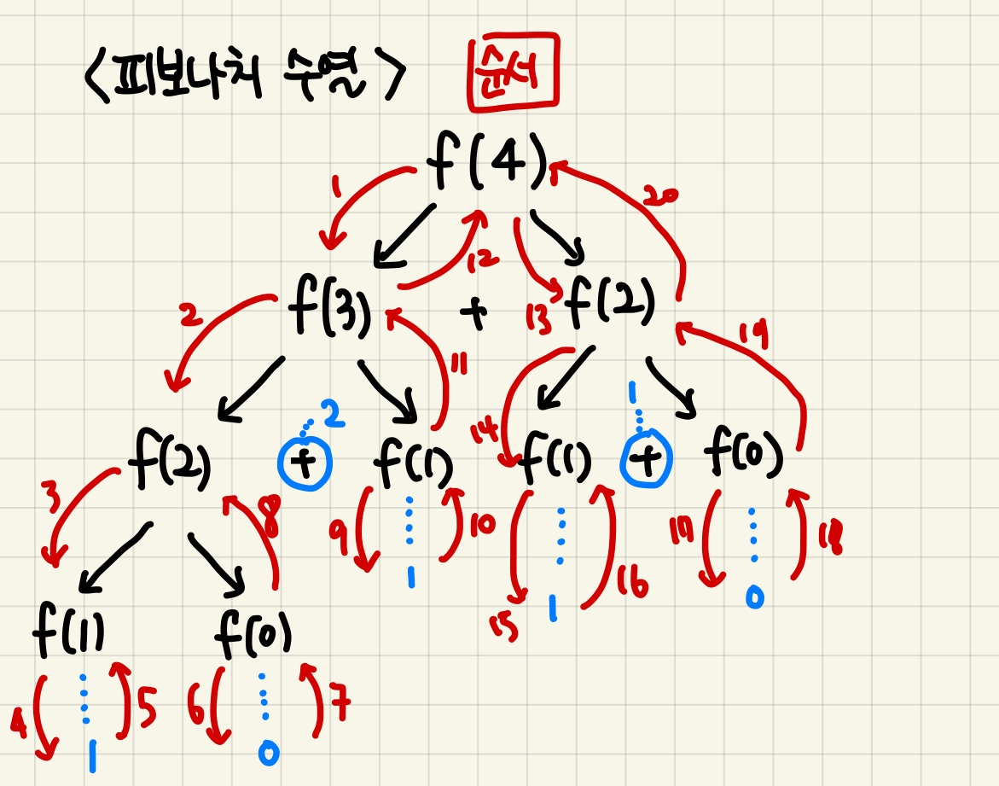

# 📚 July 21st, 2021 📚

## 1. What did i study?

```
- 함수
- 에러/예외처리

- sort 와 sorted의 차이
	-> arr.sort() : 원본을 바꾼다. 반환값은 없음.
	-> arr = sorted(arr) : 새로운 리스트를 반환
```


### 📕 함수

---


#### 📖 함수의 기초


- pstdev 함수(파이썬 표준 라이브러리 - statistics)    : import stsatictics 해서 쓸 수 있다.
  - population standard deviation
- docstring : 함수의 설명 (vscode는 마우스 가져다 대면뜨고, jupyter notebook 은 `shift` + `Tab` )
- 내장함수(Built-in Functions) : 기본적으로 내장되어있는 함수

- python tutor 를 보면, 실행문마다 작동원리 알 수 있다.

  


```python
#입력 받은 수를 세제곱하여 반환하는 함수 cube를 작성하시오.

def cube(number) :
    return number **2

print(cube(2))
print(cube(100))
```


---


#### 📖 함수 output


- 함수는 리턴할 경우 하나의 객체만 리턴할 수 있다. 복수개가 나오는 경우 하나의 튜플의 형태로 나온다.
- 명시적인 `return` 값이 없는 경우 `None` 타입이 반환된다.
- 함수를 쓰고나면 `print`하는 버릇을 들이자.

``` python
def rectangle(width, height) :
    area - width * height
    perimeter = 2 * (width + height)
    return area, perimeter

print(rectangle(30, 20))
```


---


 #### 📖 함수 input


- 위치 인자(positional Arguments) : 기본적으로 함수 호출 시 인자는 위치에 따라 함수 내에 전달됨.

  

- `Arguments` vs `Parameter` :인자는 투수고, 값은 공이고, 매개변수는 포수로 생각

``` python
# parameter (매개변수)
# 함수에 입력으로 전달된 값을 받는 변수

def my_func(a,b):
    pass

#argument({전달}인자, 인수)
#함수를 호출할 때 함수에 전달하는 입력 값
my_func(1,2)
```


- 기본 인자 값 (**보통 언제 쓰이는 것일까?** **밑에 예시로 보자**)

​	기본값을 지정하여 함수 호출 시 인자 값을 설정하지 않도록 함.

```python
# 받는 인자가 없을 때 기본 값으로 선정해서 쓸 수 있다.

def greeting(name = '익명') :
    return f'{name}, 안녕?'

print(greeting())
print(greeting('철수'))
```


- 키워드 인자(Keyword Arguments)

  ```python
  def add (x,y)
  	return
  
  add(y=2,x=5)
  add(x=5,y=2)
  add(5, y=2)
  #키워드인자 다음에 위치인자 사용불가능
  add(x=3,5)
  ```

  

- 가변 인자 리스트

  함수가 임의의 개수 인자로 호출될 수 있도록 지정

  인자들은 튜플로 묶여 처리되며, 매개변수에  *을 붙여 표현

  ```python
  def add(*args): #args는 가변인자리스트라고 관례로 쓴다.
      for arg in args:
          print(arg)
  
  add(2)
  add(2,3,4,5)
  ```

  

- 가변 키워드 인자

  - 함수가 임의의 개수 인자를 키워드 인자로 호출 될 수 있도록 지정
  - 인자들은 딕셔너리로 묶여 처리되며, 매개변수에 **를 붙여 표현

  ``` python
  def family(**kwargs):
      for key, value in kwargs:
          print(key, ":", value)
         
  family(father='John', mother='Olivia', me='Ryan')
  ```


- 함수 정의 주의 사항 

  - 기본 인자 값을 가지는 인자 다음에 기본 값이 없는 인자로 정의할 수 없다.
  - 가변 인자리스트가 위치 인자보다 앞쪽에 올 수 없다.
  - 가변 키워드 인자가 위치 인자보다 앞쪽에 올 수 없다.

  ```python
  # 이런식으로 선언하는 것이 좋다.
  my_func(x,y, *args, **kwargs)
  ```


+) 언패킹

```python
def my_func (x, *args) :
    return x, aggs


print(my_func(1,2,3)) # (1,2,3)

#언패킹
x=[1,2,3,4]
print(my_func(x)) #([1,2,3],())
print(my_func(*x)) # (1, (2,3)) //처음 매개변수 자리를 먼저 채우고 나머지 부분은 튜플로 묶어 버린다
```


---


#### 📖 함수 스코프(scope)

> **전역 스코프(`global scope`)**: 코드 어디에서든 참조할 수 있는 공간
> **지역 스코프(`local scope`)**: 함수가 만든 스코프로 함수 내부에서만 참조할 수 있는 공간
>
> **전역 변수(`global variable`)**: 전역 스코프에 정의된 변수
> **지역 변수(`local variable`)**: 로컬 스코프에 정의된 변수


-  **이름검색 규칙**

  ``` python
  global_num = 3
  print(id(global_num)) #전역 global_num 의 주소
  def local_scope():
      global_num = 5
      print(id(global_num)) #전역 global_num 의 주소
  local_scope()
  print(global_num)
  #아래의 출력문을 보면 같은 이름의 변수지만 주소가 다른 것을 알 수 있다.
  #내가 헷갈렸던 부분은 반복문,조건문 밖에서 선언된 변수가 해당 문에 따라 값이 달라지는 것을 착각했다.
  ```

  ```
  #출력문
  2167539722608
  2167539722672
  3
  ```


---


#### 📖 재귀함수


- 자기 자신을 호출하는 함수

  > 주의사항
  >
  > - 재귀함수는 최대 1000번 돕니다.
  > - 그 이후에는 stack overflow가 떠서 정지됩니다.

  ```python
  # 팩토리얼 계산을 위한 코드 반복문으로 작성
  
  def fact(num) :
      result = 1
      while num > 1 :
          result *=num
  		num-=1
      return result
  
  print(fact(3)) # 6
  
  # 다른 형태로 짜봄.
  
  def my_fact(n) :
      result =1
      for i in range(1, n+1):
          result *=i
      return result
  
  my_fact(5)
  
  #재귀형태로 작성
  
  def fact_self(n) :
  	if n == 1 : 
          return n
      else :
      	return n * fact_self(n-1)
  
  print(factorial(4))
  ```
  
  ```python
  #피보나치 수열
  #1 1 2 3 5 8 13 . . . 바로앞항+현재항
  
  #반복문
  
  def fibo_f(n) :
      #종료조건
      if n<2 :
          return n
  	a,b = 0,1
      
      for i in range(0, n-1) :
          a, b = b, a+b
      return b
  
  print(fibo_f(4))
  
  #재귀형태로 작성
  
  def fibo(n) : #n번째 값은 몇인가?
      #base case
      if n < 2 :
          return n
      else : return fib(n-1) + fib(n-2)
  ```
  
  > 피보나치 도는 순서
  
  
  
  

---


### 📕 에러/예외처리

---

#### 📖 **에러**

​	

- 문법 에러 : `SyntaxError` 안에 다양한 문법에러들이 있다.

---

#### 📖 **예외**

- 실행 도중 예상치 못한 상황을 맞이하면, 프로그램 실행을 멈춤 *- 문법적으로는 올바르다 -*

- 실행 중에 감지되는 에러들을 예외라고 부름

- 예외는 여러 타입(type)으로 나타나고, 타입이 메시지의 일부로 출력됨

- 모든 내장 예외는 Exception Class 를 상송받아 이루어짐 (아래표 외에도 많은 많은 에러들이 있다.)

  |     예외사항      |                             설명                             |
  | :---------------: | :----------------------------------------------------------: |
  | ZeroDivisionError |                  0으로 나누고자 할 때 발행                   |
  |     NameError     |               namespace 상에 이름이 없는 경우                |
  |     TypeError     | 타입 불일치<br />argument누락<br />argument 개수 초과 <br />argument type 불일치 |
  |    ValueError     |        타입은 올바르나 값이 적절하지 않거나 없는 경우        |
  |    IndexError     |        인텍스가 존재하지 않거나 범위를 벗어나는 경우         |
  |     KeyError      |                 해당 키가 존재하지 않는 경우                 |
  |    ImportError    |  Module은 있으나 존재하지 않는 클래스/ 함수를 가져오는 경우  |
  | KeyboardInterrupt |               임의로 프로그램을 종료하였을 때                |


---


#### 📖 **예외 처리(try set)**


- `try`문/ `except`문 을 이용해서 확인가능하다.

- `try`문에서 `except`에서 설정한 에러가 생기면 `except`문이 실행되고, 에러없이 아래의 다른 코드 실행 가능

  ```python
  # 복수의 예외 처리
  
  num = input('100으로 나눌 값을 입력하시오 : ')
  print(100/int(num))
  
  #입력값 : 'a' => TypeError
  #입력값 : 0 => ZeroDivisionError
  
  try :
      n = input('값 : ')
      100/int(n)
  except ValueError : print("좋은말 할 때 숫자 넣어라")
  except ZeroDivisionError :print("초등수학 다시 배우자..?")
  ```

​	

- try except문은 순차적으로 실행되기때문에 except에 가장 작은범주 부터 적어주어야한다.

  ```python
  try :
      num = input('값 : ')
      100/int(n)
  except Exception : print("뭐야 왜 에러난거야? 나도 몰라")
  except ZeroDivisionError :print("초등수학 다시 배우자..?")
  ```

  

- `try`  : 코드실행

  - `except`  : try문에서 예외가 발생 시 실행

  - `else`  : try문에서 예외가 발생하지 않으면 실행

  - `finally` : 예외 발생 여부와 관계없이 항상 실행

    | 예외 O | 예외처리 | 예외X |
    | :----: | :------: | :---: |
    |   ✅    |   try    |   ✅   |
    |   ✅    |  except  |       |
    |        |   else   |   ✅   |
    |   ✅    | finally  |   ✅   |

    

---

####   

#### 📖 예외 발생 시키기

​	**보통 디버깅 용도로 사용한다.**

- raise
- assert
