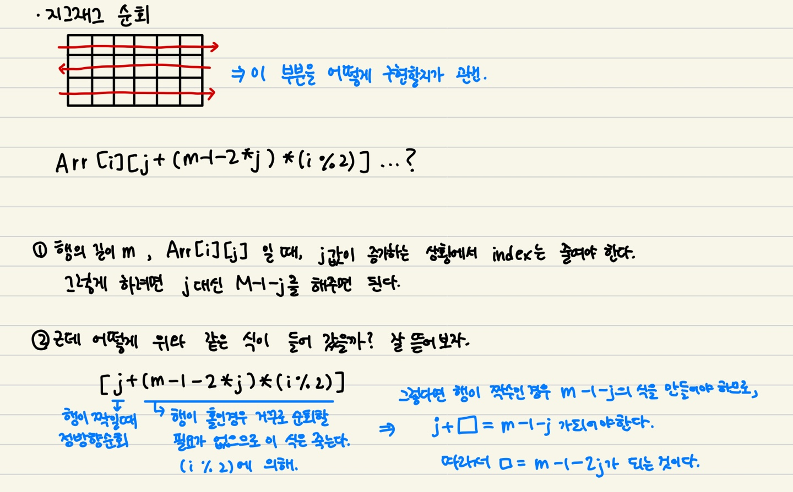
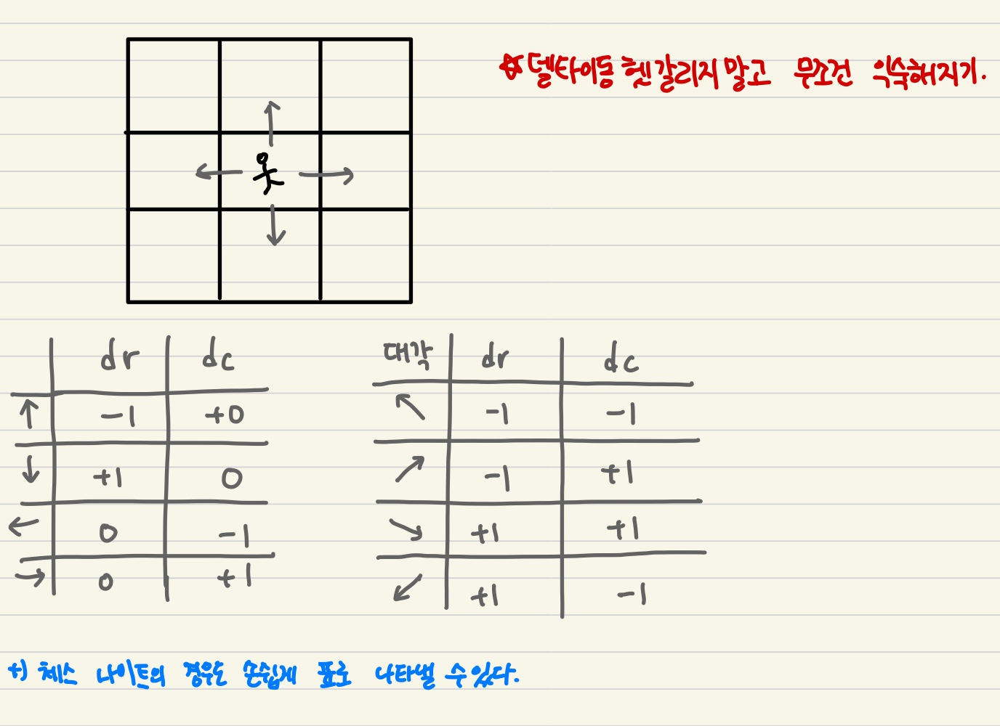
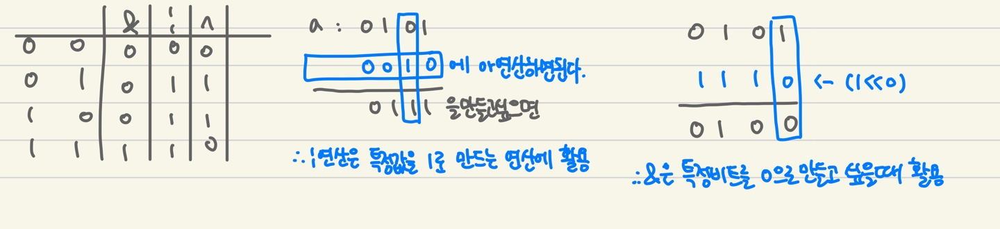

# 📚 Aug 11st, 2021 📚

> 아직 TIL 쓰는 방식이 조금 마음에 안들어서 form이 조금조금씩 바뀔 예정이다.


## 오늘 배운 내용

#### ✨ 배열

- **2차 배열**
- **부분집합 생성방법(경우의 수)**
- **검색 : 바이너리 서치(Binary Search)**
- **선택 정렬(Selection Sort)**


## 세부 내용

### 1. 2차 배열 

- #### 2차 배열 ? 1차원 리스트를 묶어놓은 리스트.

- #### 2차원 배열의 접근(행, 열, 지그재그, 델타, 전치행렬)

  - ##### 행 우선 조회는 우리가 1차 배열에서 하던 방법 그대로 이므로 생략.

  - ##### 열 우선 조회

  ```python
  arr = [[1,2,3],[4,5,6],[7,8,9]]
  for i in range(len(arr)):
      for j in range(len(arr[i])) :
          print(arr[j][i])
  ```

  

  - ##### 지그재그 순회

  >처음엔 정방향으로 순회했다가 다음 행에는 역방향으로 순회하는 논리이다.

  ```python
  arr = [[1,2,3],[4,5,6],[7,8,9]]
  #N = row 길이
  for i in range(len(arr)):
      for j in range(len(arr[i])) :
          print(arr[i][j+(m-1-2*j)*(i%2)])
  ```

  
  

  - ##### 델타를 이용한 2차 배열 탐색

  > ❗**주의**❗ 파이썬은 인덱스가 -1이 되더라도 에러나지않고 반대편끝으로 가니 주의할 것.

  ```python
  arr = [
      [1, 2, 3],
      [4, 5, 6],
      [7, 8, 9]
  ]
  
  #현재 위치를 나타내주는 친구들
  row=0
  col=1
  #리스트 길이
  N=3 
  
  # 상하좌우 나타내는 방법!
  dr = [-1, 1, 0, 0]
  dc = [0, 0, -1, 1]
  
  for i in range(4):
      # 현재 위치에서 움직일 것!
      # 현재 row = 0, col =1인 상황이다.
      # 위로 움직일 경우, 에러가 날까? No.위에서 언급한 것 처럼 -1이 되면 반대편 끝으로 가므로, 
      #위로 움직이면 8이 튀어나온다.
      nr = r + dr[i] 
      nc = c + dc[i]
  	
      #그러므로 항상 index유효성 검사를 해주는 코드를 만들어야한다.
      
      # 방법1)내가 범위안에 들어와있을 때 아래의 코드를 실행해 주세요 
      # if 0 <= nr < N and 0<=nc<N:
      #     print(arr[nr][nc],end=" ")
  
      # 방법2)범위 안에 들어오지 않았다면 그냥 다음 차례로 넘겨주세요.
      if nr < 0 or nr >= N or nc < 0 or nc >= N:
          continue
  
      print(arr[nr][nc], end=" ")
  
  	
      # 유효성 검사를 하면서도, 다른 조건이 붙을때도 유효성 먼저 테스트 해야하는 이유
      # 인덱스를 먼저 체크해서 에러안남
      if 0 <= nr < N and 0 <= nc < N and arr[nr][nc] == 2:
          print("오 2 있네?")
      # 인덱스먼저접근하기때문에 에러날수도있고 안날 수도있다.
      if arr[nr][nc] == 2 and 0 <= nr < N and 0 <= nc < N:
          print("오 2 있네?")
  ```

  

  

  - ##### 전치행렬 (행과 열을 바꾼 행렬😉)

  ```python
  arr = [
      [1, 2, 3],
      [4, 5, 6],
      [7, 8, 9]
  ]
  
  for i in range(3):
      for j in range(3) :
          if i <j : # 이 코드의 핵심 부분! 이 부분이 없다면 이중으로 바꿔줘서 다시 원래의 행렬의 모양으로 돌아옵니다.
              arr[i][j],arr[j][i] = arr[j][i],arr[i][j]
  ```


---


### 2. 부분집합 생성

```
방법1) for문을 이용

방법2) 비트연산자를 이용(어려움!)
```


- for문

>현재 bit 길이가 짧아서 구현이 가능하지만, 길이가 긴 경우 코드의 깊이가 너무 깊어지므로 주의 할 것.

```python
bit=[0,0,0,0]

for i in range(2):
    bit[0] =i
    for j in range(2):
        bit[1] = j
        for k in range(2):
            bit[2] = k
            for m in range(2):
                bit[3] = m
                print(bit) #생성된 부분집합 출력
```


- 비트 연산자 (오늘 제일 어려웠던 부분!!!)

>나는 여기서 또 한번 헷갈렸던 것은 and, or와 &,| 의 구분이었다. 
>
>두개가 같은것이 아닌가 생각할 수 있다. 그러나 &와 |는 **비트 단위**로 AND,OR 연산을 하는 것이다.
>
>1 << n  : 1을 비트단위를 보고, n만큼 왼쪽으로 민다는 소리다. 이걸 왜 하는지 알기위해 부분집합 갯수 원리를 먼저 설명한다.
>
>- 부분집합 갯수 원리 :
>
>  집합의 원소가 n개 일때 공집합을 포함한 부분집합의 갯수는 2의n제곱 개이다. 이는, **각 원소를 부분집합에 포함시키거나 포함시키지 않는 2가지 경우를 모든 원소에 적용한 경우의 수**와 같다.
>
>따라서 부분집합의 모든 경우의 수를 세기 위해 1<<n을 해주는 것이다.


```python
arr=[3,6,7,1,5,4]

n = len(arr)

for i in range(1 << n) :
    for j in range(n):
        if i & (1<<j) :
            print(arr[j],end=",")
    print()
print()
```

설명)

`1 << n`  : 1을 비트단위를 보고, n만큼 왼쪽으로 민다는 소리다. 이걸 왜 하는지 알기위해 부분집합 갯수 원리를 먼저 설명한다.

- 부분집합 갯수 원리 :

  집합의 원소가 n개 일때 공집합을 포함한 부분집합의 갯수는 2의n제곱 개이다. 이는, **각 원소를 부분집합에 포함시키거나 포함시키지 않는 2가지 경우를 모든 원소에 적용한 경우의 수**와 같다.

따라서 부분집합의 모든 경우의 수를 세기 위해 1<<n을 해주는 것이다. 여기선 0 ~ (2**6)-1 이 나온다. `range`는 마지막 원소 포함안되므로! 0~63 까지 64가지의 경우의 수(부분집합)를 나타낸다.


`i & (1<<j)` : i 의 j번째 비트가 1인지 아닌지 체크하는 문장이다. 여기서 먼저 &연산자를 알아야 한다.



따라서 &연산자는 비교하려는 대상 모두 1이여야 1이다.

j번째 비트가 1이라면 j번째 arr 을 출력(`print(arr[j],end=",")`)하는것이다. 출력말고 따로 저장하게끔 짤 수도 있다.


---


### 3. 검색(Search)

>저장되어 있는 자료 중에서 원하는 항목을 찾는 작업
>
>목적하는 탐색 키를 가진 항목을 찾는 것.
>
>검색의 종류 
>
>- 순차 검색 
>- 이진 검색
>- 해쉬 검색


#### 1) 순차 검색(Sequential Search)

>- 2가지 경우
>  - 정렬 O
>  - 정렬 X
>- 검색 과정
>  - 첫 번째 원소부터 순서대로 검색 대상과 키 값이 같은 원소가 있는지 비교하며 찾음.
>  - 키 값이 동일한 원소를 찾으면 그 원소의 인덱스 반환
>  - 자료구조의 마지막에 이를 때까지 검색 대상 찾지 못하면 검색 실패


- ##### 정렬 X 

  - 찾고자 하는 원소의 순서에 따라 비교회수가 결정 된다.

- ##### 정렬 O

  - 자료를 순차적으로 검색하면서 키 값을 비교하여, 원소의 키 값이 검색 대상의 키 값보다 크면 찾는 원소가 없다는 것이므로 더 이상 검색하지 않고 검색 종료
  - 찾고자 하는 원소의 순서에 따라 비교회수가 결정 된다. 그러나 정렬이 되어있으므로, 검색 실패를 반환하는 경우 평균 비교 회수가 반으로 줄어든다.


#### 2) 이진 검색(Binary Search)

>자료의 가운데에 있는 항목의 키 값과 비교하여 다음 검색의 위치를 결정하고 검색을 계속 진행.
>
>- 목적 키를 찾을 때까지 이진 검색을 순환적으로 반복 수행함으로써 검색 범위를 반으로 줄여가면서 보다 빠르게 검색 수행
>
>이진 검색을 하기 위해서는 자료가 **정렬된 상태**여야한다.


```python
def binarySearch(a,key) :
    start = 0
    end = len(a) -1
    while start <= end:
        middle = (start + end) // 2 #길이 짝, 홀 상관없다.
        if a[middle] == key : #검색성공
            return middle
        elif a[middle] > key :
            end = middle -1
        else :
            start = middle +1
    return -1 #검색실패


arr = [2,4,7,9,11,19,23]
print(binarySearch(arr,11)) # 4
print(binarySearch(arr,10)) # -1
```


>이진 검색은 key값을 찾을 때 까지 반으로 잘라가며 middle이 key값과 같은지 확인하는 작업이다.
>
>key 값이 배열의 중간(middle) 값보다 크다면 start를 middle+1 의 위치로 옮기고, 작다면 end를 middle-1위치로 옮긴다. 그 후, middle 값을 다시 start와 end 의 중간 값으로 두고 키값과 비교하는 형태로 간다.
>
>이진검색 전에 배웠던 건데 거의 휘발되서 사라지기 직전이라, 반으로 잘라서 검색을 한다는 것은 알고 있었지만, 그냥 반으로 잘라서 그 안에서 검색을 하는 것인 줄 알았다. 멍충멍충...
>
>이제 이진 검색에 대해 확실히 알고 넘어가자.


---


### 4. 선택 정렬(Selection Sort)

>주어진 자료들 중 가장 작은 값의 원소 부터 차례대로 선택하여 위치 교환하는 방식
>
>- 정렬 과정
>  - 주어진 리스트 중에서 최소값을 찾는다.
>  - 그 값을 리스트의 맨 앞에 위치한 값과 교환
>  - 맨 처음 위치를 제외한 나머리 리스트를 대상으로 위의 과정 반복


```python
arr = [1,5,4,7,8,9,2,4,5,2,55,234,78,345]

for i in range(0, len(arr)-1) :
    min_idx = i 
    for j in range(i+1, len(arr)) :
        if arr[min_idx] > arr[j]: # 작은 값을 가지는 index를 넣어주기 위한 조건문 
            min_idx = j
    arr[i],arr[min_idx] = arr[min_idx],arr[i]
print(arr)
```

>i 는 비교해줄 인덱스이므로 길이의 전까지만 가면 된다.
>
>내가 기존에 짜던 방식의 sorting과 절대 헷갈리지말자,, 더 헷갈릴까봐 예시로도 안적어 놓으련다.. 그 코드는 아마 8월초까지 풀던 SWEA나 BJ을 보면 볼 수 있을 것이다.
>
>로직상으로는 이해하기 쉬웠는데, 막상 구현을 하자니 if문에서 왜 이런 문장을 쓰는지 한번 고민했다..ㅎㅎ뭐든 직접 구현을 해보거나 예시 코드를 보면서 생각을 해봐야 진짜 안것이라고 할 수 있는 것 같다.
>
>그리고 보통 **버블 정렬과 선택정렬의 차이를 많이들 물어보고, 많이들 헷갈려한다**고 한다.
>
>버블 정렬은 원소두개를 비교하면서 큰값을 점차 위로 올리고, 길이가 점점 끝에서 안으로 들어오는 로직이다. 선택정렬도 값을 비교하긴 하지만, 기준점을 잡고 그 기준점 보다 작은 값을 찾도록 해서 가장 작은 값과 기준값을 바꿔주고, 기준점이 점차 오른쪽으로 가는 로직이다.

