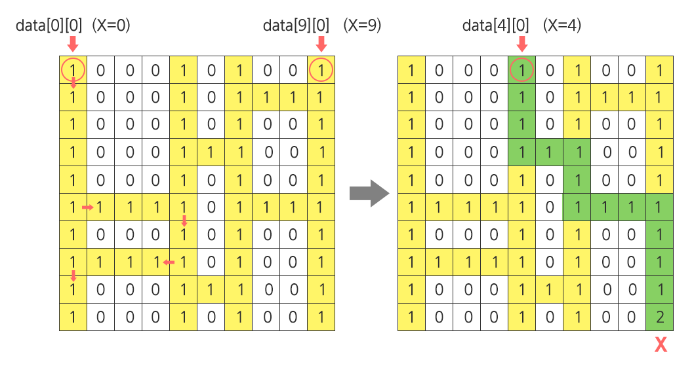
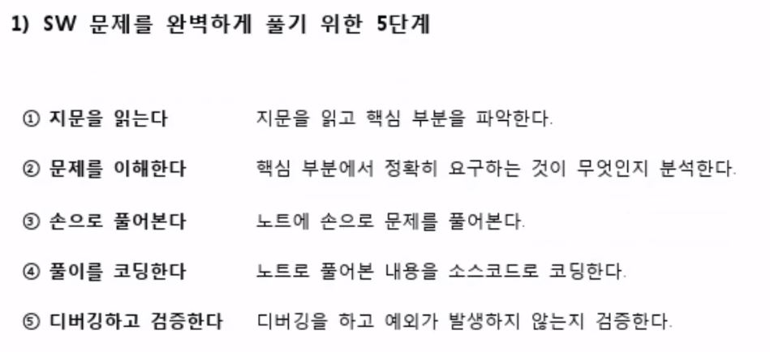

# 📚 Aug 12st, 2021 📚

> 아직 TIL 쓰는 방식이 조금 마음에 안들어서 form이 조금조금씩 바뀔 예정이다.


## 오늘 배운 내용 (어제 공부한 내용 실습위주)


## 세부 내용

### 1) SWEA Course(Programming Intermediate List2)


#### 	1) 4836.색칠하기

>그림과 같이 인덱스가 있는 10x10 격자에 빨간색과 파란색을 칠하려고 한다.
>
>N개의 영역에 대해 왼쪽 위와 오른쪽 아래 모서리 인덱스, 칠할 색상이 주어질 때, 칠이 끝난 후 색이 겹쳐 보라색이 된 칸 수를 구하는 프로그램을 만드시오.
>
>주어진 정보에서 같은 색인 영역은 겹치지 않는다.
>
>예를 들어 2개의 색칠 영역을 갖는 위 그림에 대한 색칠 정보이다.
>
>2
>
>2 2 4 4 1 ( [2,2] 부터 [4,4] 까지 color 1 (빨강) 으로 칠한다 )
>
>3 3 6 6 2 ( [3,3] 부터 [6,6] 까지 color 2 (파랑) 으로 칠한다 )
>
>**[입력]**
> 
>
>첫 줄에 테스트 케이스 개수 T가 주어진다.  ( 1 ≤ T ≤ 50 )
>
>다음 줄부터 테스트케이스의 첫 줄에 칠할 영역의 개수 N이 주어진다. ( 2 ≤ N ≤ 30 )
>
>다음 줄에 왼쪽 위 모서리 인덱스 r1, c1, 오른쪽 아래 모서리 r2, c2와 색상 정보 color가 주어진다. ( 0 ≤ r1, c1, r2, c2 ≤ 9 )
>
>color = 1 (빨강), color = 2 (파랑)
>
> 
>
>**[출력]**
> 
>
>각 줄마다 "#T" (T는 테스트 케이스 번호)를 출력한 뒤, 답을 출력한다.

##### ✨코드

```python
T = int(input())

for tc in range(1,T+1):
    N = int(input())
    ls = [list(map(int, input().split())) for _ in range(N)]


    red_ls =[] #빨간색 칠해진 좌표 받을 리스트
    blue_ls=[] #파란색 칠해진 좌표 받을 리스트

    for i in range(len(ls)) :
        if ls[i][-1] == 1 : #빨간색 리스트로갈 친구들
            for x in range(ls[i][0],ls[i][2]+1) : # x좌표
                for y in range(ls[i][1],ls[i][3]+1) : #y좌표
                    red_ls.append([x,y])
        else : #파란색 리스트로 갈 친구들
            for x in range(ls[i][0],ls[i][2]+1) : # x좌표
                for y in range(ls[i][1],ls[i][3]+1) : #y좌표
                    blue_ls.append([x,y])
    cnt = 0
    for red in red_ls :
        for blue in blue_ls :
            if red == blue :
                cnt += 1
                break
                
    print('#{} {}'.format(tc,cnt))
```

##### 💬 코멘트

>여기서 주의할 점은, 만약 조건에서 '주어진 정보에서 같은 색인 영역은 겹치지 않는다.' 가 없었다면 픽셀값을 넣을때 중복된 값이 들어갈 수 있어서 `cnt`값이 달라질 수 있다는 점이었다.. 하지만 난..! 문제를 꼼꼼히 읽지않아서 나중에 선생님이 풀이해주실 때 알았다. 문제를 꼼꼼히 읽자..!!!


#### 	2) 4837. 부분집합의 합

>1부터 12까지의 숫자를 원소로 가진 집합 A가 있다. 집합 A의 부분 집합 중 N개의 원소를 갖고 있고, 원소의 합이 K인 부분집합의 개수를 출력하는 프로그램을 작성하시오.
>
>해당하는 부분집합이 없는 경우 0을 출력한다. 모든 부분 집합을 만들어 답을 찾아도 된다.
>
>예를 들어 N = 3, K = 6 경우, 부분집합은 { 1, 2, 3 } 경우 1가지가 존재한다.
>
> 
> 
>
>**[입력]**
>
>첫 줄에 테스트 케이스 개수 T가 주어진다. ( 1 ≤ T ≤ 50 )
>
>테스트 케이스 별로 부분집합 원소의 수 N과 부분 집합의 합 K가 여백을 두고 주어진다. ( 1 ≤ N ≤ 12, 1 ≤ K ≤ 100 )
>
> 
>
>**[출력]**
>
>각 줄마다 "#T" (T는 테스트 케이스 번호)를 출력한 뒤, 답을 출력한다.

##### ✨코드

```python
#비트연산자 사용
T = int(input())

for tc in range(1,T+1) :
    # N : 원소의 수
    # K : 부분집합의 합
    N,K = map(int,input().split())
    arr = [1,2,3,4,5,6,7,8,9,10,11,12] #리스트를 먼저 넣어줬다.

    n = len(arr)
    cnt = 0

    sub =[] # 원소의수가 N개일때만 담을 리스트 변수
    for i in range(1 << n): # 모든 경우의 수 비트연산자로 뽑는다.
        curr_sub = [] # 현재의 부분집합을 담을 변수
        for j in range(n):
            if i & (1 << j):
                curr_sub.append(arr[j])
        if len(curr_sub) == N: #원소갯수가 N개일 때 sub변수에 추가
            sub.append(curr_sub)


    for i in range(len(sub)) :
        curr_sum = 0 #이 변수를 안에 넣어야 리스트별 합이 초기화가 된다!
        for j in range(len(sub[i])):
            curr_sum += sub[i][j]
        if curr_sum == K :
            cnt += 1

    print('#{} {}'.format(tc, cnt))
```

##### 💬 코멘트

>이 문제는 어제 배운 비트연산자를 이용해서 부분집합을 생성하는 연습문제였다. 여기서 헤맸던 점은 `curr_sum = 0` 이부분을 첫번째 for문 밖에 선언한 까닭에 초기화가 되지않아서 test case에서 막혔다. 사실 혼자 해결할 수 있는 부분이었는데 달팽이 문제때문에 멘탈터진상태라서 못 찾았던 것 같다. 항상 반복문 쓸때 변수 초기화를 어느시점에서 해줄지 고민! 또 고민!
>
>아 그리고 모든 경우의수를 뽑자니 시간이 run time이 오래걸릴 것 같아서 for문을 통해서 뽑았더니, 원소가 {1,2,3}{1,3,2}이렇게 중복된게 뽑혀서 이방법 fail..
>
>이 방법으로 푸려고 붙들고 있다가 미련을 버리고 비트연산자로 다시 짰다.
>
>근데 슨생님이 풀이시간에 말씀하셨다. "내가 푼 방법으로 틀린 것 같으면 과감히 포기할 줄도 알아야해요~"
>
>음..난 미련덩어리라서 미련버리는데 시간이 오래걸렸다. ^^ 이 부분도 염두해 둬야겠다!!


#### 	3) 4839. 이진탐색

>코딩반 학생들에게 이진 탐색을 설명하던 선생님은 이진탐색을 연습할 수 있는 게임을 시켜 보기로 했다.
>
>짝을 이룬 A, B 두 사람에게 교과서에서 각자 찾을 쪽 번호를 알려주면, 이진 탐색만으로 지정된 페이지를 먼저 펼치는 사람이 이기는 게임이다.
>
>예를 들어 책이 총 400쪽이면, 검색 구간의 왼쪽 l=1, 오른쪽 r=400이 되고, 중간 페이지 c= int((l+r)/2)로 계산한다.
>
>찾는 쪽 번호가 c와 같아지면 탐색을 끝낸다.
>
>A는 300, B는 50 쪽을 찾아야 하는 경우, 다음처럼 중간 페이지를 기준으로 왼쪽 또는 오른 쪽 영역의 중간 페이지를 다시 찾아가면 된다.
>
>
>|              | A                       | B                     |
>| ------------ | ----------------------- | --------------------- |
>| 첫 번째 탐색 | l=1, r=400, c=200       | l=1, r=400, c=200     |
>| 두 번째 탐색 | l=200, r=400, **c=300** | l=1, r=200, **c=100** |
>| 세 번째 탐색 |                         | l=1, r=100, **c=50**  |
>
>
>책의 전체 쪽수와 두 사람이 찾을 쪽 번호가 주어졌을 때, 이진 탐색 게임에서 이긴 사람이 누구인지 알아내 출력하시오. 비긴 경우는 0을 출력한다.
>
>
>
>
>**[입력]**
>
>
>첫 줄에 테스트 케이스 개수 T가 주어진다. 1<=T<=50
>
>
>테스트 케이스 별로 책의 전체 쪽 수 P, A, B가 찾을 쪽 번호 Pa, Pb가 차례로 주어진다. 1<= P, Pa, Pb <=1000
>
>
>**[출력]**
>
>각 줄마다 "#T" (T는 테스트 케이스 번호)를 출력한 뒤, A, B, 0 중 하나를 출력한다.

##### ✨코드

```python
T = int(input())

def search_page(book_page,key) :
    start = 0
    end = len(book_page) - 1
    cnt = 0
    #이진탐색
    while start <= end:
        middle = (start + end) // 2  # 길이 짝, 홀 상관없
        if book_page[middle] == key:  # 검색성공한 경우
            cnt += 1
            return cnt
        elif book_page[middle] > key: # 찾는 쪽수가 중간 값 보다 작은 경우
            cnt += 1
            end = middle #문제 잘읽자!!!!!여기 문제에서는 middle값으로 설정해준다.
        else: #찾는 쪽수가 중간 값보다 큰 경우
            cnt += 1
            start = middle


for tc in range(1,T+1) :

    P, A_key, B_key = map(int,input().split())
    book_page = [i for i in range(1,P+1)]

    A = search_page(book_page,A_key)
    B = search_page(book_page,B_key)

    if A > B : #찾는 횟수가 작은 사람이 이긴 것이므로 (이 부분 반대로 print해서 결과가 반대로 나왔었다.)
        print('#{} B'.format(tc))
    elif A < B :
        print('#{} A'.format(tc))
    else :
        print('#{} 0'.format(tc))
```

##### 💬 코멘트

>이 문제도 어제 배운 이진 탐색부분이다. 
>
>다만 다른 점은 문제에서 start나 end를 middle값으로 바꿔 줄때 middle +1 이나 middle -1가 아닌 middle 로 준 것이다.
>
>이 부분을 제외하고는 어려운 코드 부분은 없었다.
>
>이 문제도 문제를 자세히 읽지 않아서 발생한 문제다...


#### 	4) 4843. 특별한 정렬

>보통의 정렬은 오름차순이나 내림차순으로 이루어지지만, 이번에는 특별한 정렬을 하려고 한다.
>
>N개의 정수가 주어지면 가장 큰 수, 가장 작은 수, 2번째 큰 수, 2번째 작은 수 식으로 큰 수와 작은 수를 번갈아 정렬하는 방법이다.
>
>예를 들어 1부터 10까지 10개의 숫자가 주어지면 다음과 같이 정렬한다.
> 
>
>10 1 9 2 8 3 7 4 6 5
> 
>
>주어진 숫자에 대해 특별한 정렬을 한 결과를 10개까지 출력하시오
>
> 
> 
>
>**[입력]**
> 
>
>첫 줄에 테스트 케이스 개수 T가 주어진다. 1<=T<=50
>
>다음 줄에 정수의 개수 N이 주어지고 다음 줄에 N개의 정수 ai가 주어진다. 10<=N<=100, 1<=ai<=100
>
> 
>
>**[출력]**
> 
>
>각 줄마다 "#T" (T는 테스트 케이스 번호)를 출력한 뒤, 특별히 정렬된 숫자를 10개까지 출력한다.

##### ✨코드

```python
T=int(input())

for tc in range(1, T+1):
    N = int(input())
    ls = list(map(int,input().split()))

    max_flag = 0 # 큰 값을 가진 인덱스 넣어줄 곳
    min_flag = 0 # 작은 값을 가진 인덱스 넣어줄 곳

    for i in range(len(ls)-1) :
        max_flag = i  # 큰 값을 가진 인덱스 넣어줄 곳
        min_flag = i # 작은 값을 가진 인덱스 넣어줄 곳
        if i % 2 == 0 : # idx가 짝인 곳에 큰값을 넣어주므로
            for j in range(i+1, len(ls)):
                if ls[max_flag] < ls[j] :
                    max_flag = j
            ls[i],ls[max_flag] = ls[max_flag],ls[i]
        else : #idx가 짝인 곳에 작은 값을 넣어주므로
            for k in range(i+1, len(ls)):
                if ls[min_flag] > ls[k] :
                    min_flag = k
            ls[i],ls[min_flag] = ls[min_flag],ls[i]


    print('#{} {}'.format(tc,' '.join(map(str, ls[0:10]))))
```

##### 💬 코멘트

>이 문제를 읽으면서 선택정렬을 이용해야겠다는 생각이 들었다. 그래서 선택정렬을 이용해서 문제를 풀었다.
>
>항상 값만을 가지고있게하는 습관을 들이다보니 인덱스를 바꿔줘서 스왑하는게 조금 어색했다. 조금의 연습이 더 필요할 듯.
>
>선택정렬을 배운지 시간이 지났을 때도 이렇게 번뜩 떠올라야 할텐데..
>
>이 문제도 마지막에 출력부분 조건때문에 한번 틀렸다. ~~인간의 욕심은 끝이없고,,같은 실수를 반복하지..예,,~~


### 2) SWEA. 1954 달팽이 숫자

>달팽이는 1부터 N*N까지의 숫자가 시계방향으로 이루어져 있다.
>
>다음과 같이 정수 N을 입력 받아 N크기의 달팽이를 출력하시오.
>
>**[예제]**
>
>N이 3일 경우,
> 
>
>
>
>
>N이 4일 경우,
> 
>
>
>
>
>**[제약사항]**
>
>달팽이의 크기 N은 1 이상 10 이하의 정수이다. (1 ≤ N ≤ 10)
>
>
>**[입력]**
>
>가장 첫 줄에는 테스트 케이스의 개수 T가 주어지고, 그 아래로 각 테스트 케이스가 주어진다.
>
>각 테스트 케이스에는 N이 주어진다.
>
>
>**[출력]**
>
>각 줄은 '#t'로 시작하고, 다음 줄부터 빈칸을 사이에 두고 달팽이 숫자를 출력한다.
>
>(t는 테스트 케이스의 번호를 의미하며 1부터 시작한다.)


#### 방법1)

```python
#행 -> 열로 바뀔때 채워지는 수가 1씩 줄어드는 로직을 이용
T = int(input())

for tc in range(T):
    N = int(input())
    arr = [[0] * N for _ in range(N)]
    n = N
    i, j = 0, -1 # 로직이 한칸 +1 후에 값을 넣어주는 식인데, 첫행을 0,0부터 시작하면 첫번째에 값이 들어가지 않는다.
    num =1 # 채워 넣어줄 숫자

    while n >= 1:
        #정방향
        for _ in range(n):
            j += 1 # col 증가
            arr[i][j] = num
            num += 1
        n = n-1 #행 -> 열로 바뀌면 채워야하는 값이 1씩 줄어듦

        #위->아래
        for _ in range(n):
            i += 1 #row 증가
            arr[i][j] = num
            num += 1

        # 오->왼
        for _ in range(n):
            j -= 1 #col 감소
            arr[i][j] = num
            num += 1
        n -= 1 #행 -> 열로 바뀌면 채워야하는 값이 1씩 줄어듦

        # 아래 -> 위
        for _ in range(n) :
            i -= 1 #row 감소
            arr[i][j] = num
            num += 1


    print('#{}'.format(tc+1))

    for x in range(len(arr)) :
        print('{}'.format(' '.join(map(str, arr[x]))))
```

##### 💬 코멘트

>진짜 이문제를 몇시간 붙들었는지 모르겠다..하..규칙도 강의들을때 들었던 방법으로 푼 것인데 구현하는데 꽤나 오래걸렸다.
>
>이 방법으로 선생님이 풀이해 주셨는데 행->열 일땐 내가 푼 것 처럼 넣는 수가 1씩줄어드는 규칙을 이용했고, 열 ->행일 땐 인덱스 값 증감되는 규칙을 이용하셨다. 이 규칙은 내가 고려하지 못한 부분이었다.
>
>그렇게 풀면 	

```python
d = 1 #인덱스 증가,감소 checkpoint가 되는 곳
    while True:
        # 정방향
        for _ in range(n):
            j += d  # col 증가
            arr[i][j] = num
            num += 1

        # 행 -> 열
        n = n - 1  # 행 -> 열로 바뀌면 채워야하는 값이 1씩 줄어듦
        if n < 0: break

        # 위->아래
        for _ in range(n):
            i += d  # row 증가
            arr[i][j] = num
            num += 1

        # 열 -> 행 : 방향전환
        d *= 1 #d
```

>이렇게 코드가 훨씬 간편해 진다.

#### 방법2) 

>델타를 이용한 방향 전환
>
>이 방법은 행과 열을 이용해 이동하는데 어떻게 이동하는지 헷갈리지 않게 조심하자..!

```python
T = int(input())


for tc in range(T) :
    N = int(input())

    arr = [[0]*N for _ in range(N)] # 2차원 배열 생성

    #우 하 좌 상
    dr = [0, 1, 0, -1] # 행
    dc = [1, 0, -1, 0] # 열

    arr = [[0]*N for _ in range(N)]
    cnt = 1
    i , j = 0 , -1  #출발지점 지정

    k=0 # 방향전환

    while cnt<=N*N:
        ni,nj = i+dr[k] , j+dc[k] # 이동!
        if 0<= ni < N and 0<= nj < N and arr[ni][nj] == 0 : #값이 유효할때, 그리고 값이 0일때만 값을 넣어주도록한다.
            arr[ni][nj] = cnt
            cnt += 1
            i , j = ni , nj
        else :
            #if k == 4 : k ==0 으로 해도 된다.
            k = (k+1) % 4 #어떤 값을 삥글삥글 돌게하고싶을때 사용하자!!나머지 연산!!
```


### 3) SWEA. 1210 사다리타기

>점심 시간에 산책을 다니는 사원들은 최근 날씨가 더워져, 사다리 게임을 통하여 누가 아이스크림을 구입할지 결정하기로 한다.
>
>김 대리는 사다리타기에 참여하지 않는 대신 사다리를 그리기로 하였다.
>
>사다리를 다 그리고 보니 김 대리는 어느 사다리를 고르면 X표시에 도착하게 되는지 궁금해졌다. 이를 구해보자.
>
>아래 <그림 1>의 예를 살펴보면, 출발점 x=0 및 x=9인 세로 방향의 두 막대 사이에 임의의 개수의 막대들이 랜덤 간격으로 추가되고(이 예에서는 2개가 추가됨) 이 막대들 사이에 가로 방향의 선들이 또한 랜덤하게 연결된다.
>
>X=0인 출발점에서 출발하는 사례에 대해서 화살표로 표시한 바와 같이, 아래 방향으로 진행하면서 좌우 방향으로 이동 가능한 통로가 나타나면 방향 전환을 하게 된다.
>
>방향 전환 이후엔 다시 아래 방향으로만 이동하게 되며, 바닥에 도착하면 멈추게 된다.
>
>문제의 X표시에 도착하려면 X=4인 출발점에서 출발해야 하므로 답은 4가 된다. 해당 경로는 별도로 표시하였다.
> 
>
>
><그림 1> 사다리 게임에 대한 설명 (미니맵)
>
>
>아래 <그림 2>와 같은 **100 x 100 크기의 2차원 배열로 주어진 사다리에 대해서, 지정된 도착점에 대응되는 출발점 X를 반환하는 코드를 작성하라** (‘0’으로 채워진 평면상에 사다리는 연속된 ‘1’로 표현된다. 도착 지점은 '2'로 표현된다).
>
> 
>
> <그림 2> 테스트 케이스에 의해 생성되는 실제 사다리의 모습
>
>
>**[제약 사항]**
>
>한 막대에서 출발한 가로선이 다른 막대를 가로질러서 연속하여 이어지는 경우는 없다.
>
>**[입력]**
>
>입력 파일의 첫 번째 줄에는 테스트 케이스의 번호가 주어지며, 바로 다음 줄에 테스트 케이스가 주어진다.
>
>총 10개의 테스트 케이스가 주어진다.
>
>**[출력]**
>
>\#부호와 함께 테스트 케이스의 번호를 출력하고, 공백 문자 후 도착하게 되는 출발점의 x좌표를 출력한다.

```python
# 다리가 있을 때 사다리 타기해주는 모듈
def letsgo(arr, r, c): 
    start = c # 출발한 인덱스 저장
    while r < 99 :

        r = r + dr[0] #아래로 이동먼저 (이렇게 해야 왼,오 이동 후에 다시 반대로 도는 현상이 없다.)

        if c - 1 > -1 and arr[r][c - 1] == 1:  # 가장 왼쪽 다리가 아니고, 왼쪽에 길이 있으면
            while arr[r][c - 1] == 1:  # 왼쪽 끝까지 이동
                c += dc[2]
                if c == 0:  # 가장 앞지점으로 오면 break(이 문장이 없으면 오른쪽끝 사다리로 가서 while문 돌아버림)
                    break

        elif c + 1 < 100 and arr[r][c + 1] == 1:  # 가장 오른쪽 다리가 아니고, 오른쪽에 길이 있으면
            while arr[r][c + 1] == 1:  # 오른쪽 끝까지 이동
                c += dc[1] 
                if c == 99:
                    break  # 가장 끝지점으로 왔을 때 break
	
    # 마지막 지점이 2인지 아닌지 확인
    if arr[r][c] == 1 :
        return 0
    if arr[r][c] == 2 :
        return start


# main
for _ in range(10):
    tc = int(input()) 
    arr = [list(map(int, input().split())) for _ in range(100)] 


    dr = [1, 0, 0]  # 아래, 오, 왼
    dc = [0, 1, -1]

    r = 0
    c = 0
    #print(arr)
    for start_idx in range(100):
        r = 0
        c = start_idx
        if arr[r][c] ==1 : # 다리가 있는 경우
            arrive = letsgo(arr, r, c) #사다리 타기
            if arrive : 
                print('#{} {}'.format(tc,arrive))
                break
```

##### 💬 코멘트

> 처음 접근은 사다리가 처음과 끝일때 와 아닐 때를 구분하려고 했다 . 그렇게 하려고 하니 로직이 중복되기도 하고 중간다리 사다리타기 조건을 줄때 생각해보니 굳이 나눌 필요가 없다는걸 알았다. 함수  `c - 1 > -1`  조건을 줘서 가장 왼쪽 사다리는 왼쪽에 길이 있는지 판별을 안하도록 했다. 오른쪽 다리도 이에 해당하는 조건을 주는 걸로 해결!
>
>이것도 시간이 상당히 걸렸다..ㅠㅠ
>
>사다리 타는 어플 많다..어플 쓰자..^^


## 📢오늘의 교훈


